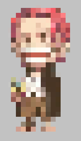

## 马赛克 Pixel

  
[官网文档 Accessing shader properties in Cg/HLSL](https://docs.unity3d.com/Manual/SL-PropertiesInPrograms.html)  
#### Special Texture properties
对于每一个被设置为着色器/材质属性的纹理，Unity也在额外的向量属性中设置了一些额外的信息。  
##### Texture tiling & offset
材质的纹理属性通常有平铺和偏移域。这个信息通过**float4 {TextureName}_ST**属性传递到着色器  
x contains X tiling value  
y contains Y tiling value  
z contains X offset value  
w contains Y offset value  
##### Texture size
**{TextureName}_TexelSize**则是一个float4属性包含纹理大小信息:  
x contains 1.0/width  
y contains 1.0/height  
z contains width  
w contains height  

先把uv的精度降低，再进行纹理取样，达到马赛克的效果，这里0.95控制像素大小在1~20倍之间过渡，具体实现：
```
// round()返回标量或向量的四舍五入值
// _MainTex_TexelSize.zw分别是纹理的宽高
// factor范围0~1

fixed4 frag (v2f i) : SV_Target
{
	half2 pixelSize = max(2, (1 - factor * 0.95) * _MainTex_TexelSize.zw);
	i.uv = round(i.uv * pixelSize) / pixelSize;
    fixed4 col = tex2D(_MainTex, i.uv);
    return col;
}
```