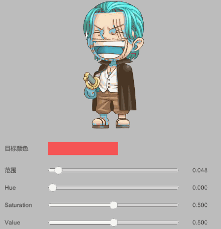

## HSV Modifier
  
HSV是Hue(色调), Saturation(饱和度), Value(亮度)的缩写  

##### step
实现一个step函数，对于x中大于或等于参考向量a中对应分量的每个分量返回1，否则返回0。

```
float3 step(float3 a, float3 x)
{
    return x >= a;
}
```

##### 具体实现：
C#端
```
float h, s, v;
Color.RGBToHSV(m_TargetColor, out h, out s, out v);

var param1 = new Vector4(h, s, v, m_Range);
newMaterial.SetVector("_Param1", param1);

// 传入的范围必须是0~1，所以右移0.5
var param2 = new Vector4(m_Hue + 0.5f, m_Saturation + 0.5f, m_Value + 0.5f, 0);
newMaterial.SetVector("_Param2", param2);
```
shader
```
// Apply Hsv effect.
half4 ApplyHsvEffect(half4 color, fixed4 param1, fixed4 param2)
{
    fixed3 targetHsv = param1.rgb;			// 目标颜色的HSV值
    fixed targetRange = param1.w;			// 与目标颜色的偏差范围,(0~1),越小越接近目标颜色
    
    fixed3 hsvShift = param2.xyz - 0.5;		// HSV偏移(-0.5~0.5)
	half3 hsv = RgbToHsv(color.rgb);		// 源颜色的HSV值
	half3 range = abs(hsv - targetHsv);		// 源颜色与目标颜色，HSV各值的绝对值偏差

	// 求出偏差值H,S,V中最最大的，作为源颜色与目标色的偏差值，其中S,V要缩小10倍
	half diff = max(max(min(1-range.x, range.x), min(1-range.y, range.y)/10), min(1-range.z, range.z)/10);

	// 目标偏差比实际偏差大的，加上HSV偏移
	fixed masked = step(diff, targetRange);
	color.rgb = HsvToRgb(hsv + hsvShift * masked);
	return color;
}
```