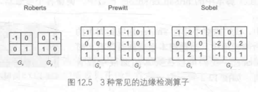

## 边缘检测

  

边缘检测是描边效果的一种实现。

#### 卷积
卷积指使用一个**卷积核**(kernel)对一张图像中每个像素进行一系列操作。  
  

#### 实现

```
//        1  0 -1     -1 -2 -1
//    X = 2  0 -2  Y = 0  0  0
//        1  0 -1      1  2  1
half sobel(half2 center, half2 step)
{
    half bottomLeft = Luminance(tex2D(_MainTex, center + half2(-step.x, -step.y)));
    half midBottom = Luminance(tex2D(_MainTex, center + half2(0, step.y)));
    half bottomRight = Luminance(tex2D(_MainTex, center + half2(step.x, -step.y)));
    half midLeft = Luminance(tex2D(_MainTex, center + half2(-step.x, 0)));
    half midRight = Luminance(tex2D(_MainTex, center + half2(step.x, 0)));
    half topLeft = Luminance(tex2D(_MainTex, center + half2(-step.x, step.y)));
    half midTop = Luminance(tex2D(_MainTex, center + half2(0, step.y)));
    half topRight = Luminance(tex2D(_MainTex, center + half2(step.x, step.y)));

    half Gx = topLeft + 2.0 * midLeft + bottomLeft - topRight - 2.0 * midRight - bottomRight;
    half Gy = -topLeft - 2.0 * midTop - topRight + bottomLeft + 2.0 * midBottom + bottomRight;

    half edge = sqrt((Gx * Gx) + (Gy * Gy));
    // half edge = abs(Gx) + abs(Gy);          // 用绝对值操作代替开根号，可优化性能 

    return edge;
}


fixed4 frag (v2f i) : SV_Target
{
    fixed4 col = tex2D(_MainTex, i.uv);

    half edge = sobel(i.uv, _MainTex_TexelSize.xy * _EdgeWidth);
    fixed4 bg = lerp(fixed4(0,0,0,0), lerp(fixed4(col.rgb, 0), col, _BgAlpha), _BgToggle);
    col = lerp(bg, _EdgeColor, min(col.a, edge));

    return col;
}
```

#### 参考
[Sobel operator](http://en.wikipedia.org/wiki/Sobel_operator)  