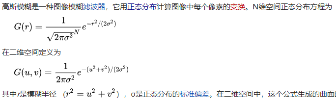

## 模糊

  
#### 高斯模糊
高斯模糊（Gaussian Blur），也叫高斯平滑（Gaussian smoothing），作为最经典的模糊算法，一度成为模糊算法的代名词。  
高斯模糊在图像处理领域，通常用于减少图像噪声以及降低细节层次，以及对图像进行模糊，其视觉效果就像是经过一个半透明屏幕在观察图像。  
  

#### 实现
```
fixed4 frag (v2f i) : SV_Target
{
    const int KERNEL_SIZE = 7;
    const float KERNEL_[7] = { 0.1719, 0.4566, 0.8204, 1.0, 0.8204, 0.4566, 0.1719};

    sampler2D tex = _MainTex;
    half2 texcood = i.uv;
    half2 blur = _MainTex_TexelSize.xy * 2;

    float4 o = 0;
    float sum = 0;
    float2 shift = 0;
    for(int x = 0; x < KERNEL_SIZE; x++)
    {
        shift.x = blur.x * (float(x) - KERNEL_SIZE/2);
        for(int y = 0; y < KERNEL_SIZE; y++)
        {
            shift.y = blur.y * (float(y) - KERNEL_SIZE/2);
            float2 uv = texcood + shift;
            float weight = KERNEL_[x] * KERNEL_[y];
            sum += weight;
            o += tex2D(tex, uv) * weight;
        }
    }
    fixed4 col = o / sum;

    #endif


    return col;
}
```

#### 参考
[高品质后处理：十种图像模糊算法的总结与实现](https://zhuanlan.zhihu.com/p/125744132)  