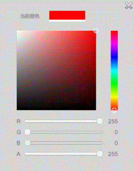

##### unity中制作一个调色板

  

###### 背景
项目中，需要提供一个可以自定义颜色的功能，因此仿照PS中的颜料板，在unity中制作了一个。这里可以通过修改rbga通道值、光标在渐变色块中的位置，来修改颜色值。

###### 实现
渐变色块用的是RawImage
```
// 单色渐变块

_tex2d = new Texture2D(256, 256, TextureFormat.RGB24, true);
view.rawImage.texture = _tex2d;
float max = Mathf.Max(_Color.r, _Color.g, _Color.b);
_tempMaxColor = max == 0 ? Color.red : _Color / max;
float min = Mathf.Min(_tempMaxColor.r, _tempMaxColor.g, _tempMaxColor.b);
if (min == 1)
{
    _tempMaxColor = Color.red;
}
else
{
    float v = 1f / (1 - min);
    _tempMaxColor = new Color(
        Mathf.LerpUnclamped(1, _tempMaxColor.r, v),
        Mathf.LerpUnclamped(1, _tempMaxColor.g, v),
        Mathf.LerpUnclamped(1, _tempMaxColor.b, v));
}

for (int i = 0; i < 256; i++)
{
    _tempColor = Color.Lerp(Color.white, _tempMaxColor, i / 255f);
    for (int j = 0; j < 256; j++)
    {
        _colorArray[j * 256 + i] = Color.Lerp(Color.black, _tempColor, j / 255f);
    }
}
_tex2d.SetPixels(_colorArray);
_tex2d.Apply();

// 多色渐变块
Color[] _hueColors = new Color[6] { 
	Color.red, 
	new Color(1, 1, 0), 
	Color.green, 
	Color.cyan, 
	Color.blue, 
	Color.magenta };

var hueColorArray = new Color[360];
var hueTex2d = new Texture2D(1, 360, TextureFormat.RGB24, true);
view.hueRawImage.texture = hueTex2d;
for (int i = 0; i < 360; i++)
{
    int index = i / 60;
    int mod = i % 60;
    hueColorArray[i] = Color.Lerp(_hueColors[index], _hueColors[(index + 1) % 6], mod / 60f);
}
hueTex2d.SetPixels(hueColorArray);
hueTex2d.Apply();
```
拖动色块通过继承IDragHandler, IPointerDownHandler实现
```
public void OnDrag(PointerEventData eventData)
{
    OnPointerEvent(eventData);
}
public void OnPointerDown(PointerEventData eventData)
{
    OnPointerEvent(eventData);
}

private void OnPointerEvent(PointerEventData eventData)
 {
     RectTransformUtility.ScreenPointToLocalPointInRectangle(_rt, eventData.position, Camera.main,out _localPos);
     if (_onPointerEvent != null) _onPointerEvent(_localPos);
 }
```
修改rbga通道值、光标在渐变色块中的位置猴，直接算出最终颜色，再反推出对应应该显示的色块颜色和光标在色块中的位置。